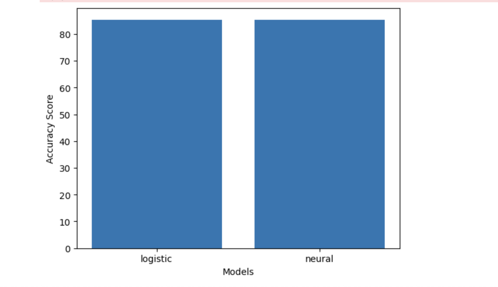

# Machine Learning with Heart Disease Data  

## Overview  
This project involves a comprehensive Machine Learning analysis using Logistic Regression and a Simple Neural Network to predict heart disease using the dataset available at [Kaggle - Heart Disease Prediction](https://www.kaggle.com/datasets/dileep070/heart-disease-prediction-using-logistic-regression).  

## Tools & Technologies  
- Programming Language: Julia  
- Development Environment: VS Code  
- Reference: UTD COIN Lab Tutorial - [IJML](https://athulsudheesh.github.io/IJML/)  

## Data Preparation  
- Dropped missing data to maintain data integrity.  
- Split the dataset into training and testing sets.  

## Models & Accuracy  
1. Logistic Regression:  
   - Achieved an accuracy of 0.84.  

2. Simple Neural Network:  
   - Best performing model utilized the "Limited-memory BFGS" optimization algorithm.  
   - Accuracy: 0.84.  

## Key Takeaways  
- Both models performed similarly with accuracy above 0.84, indicating potential for further tuning and exploration.  
- The neural network model provided slightly better generalization due to its optimization algorithm.  

